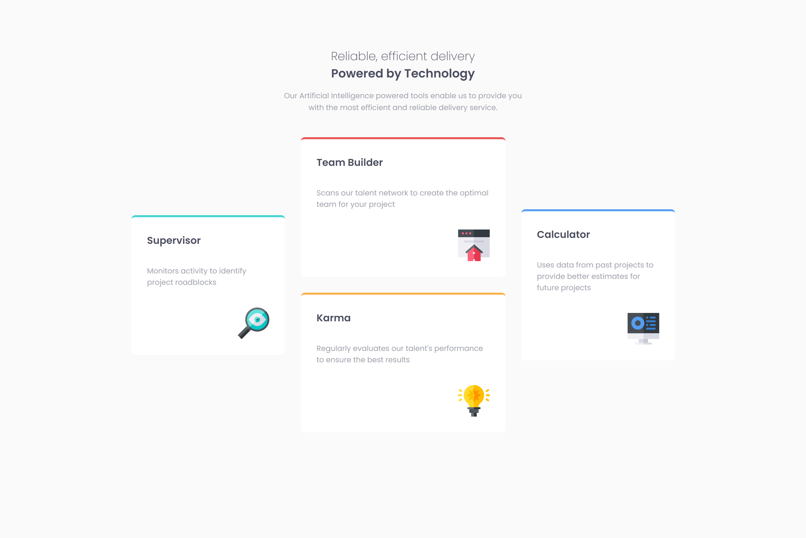
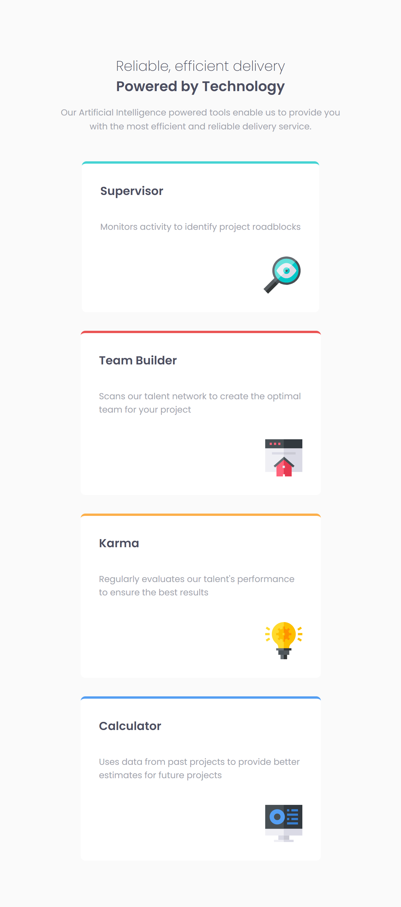

# Frontend Mentor - Four card feature section solution

This is a solution to the [Four card feature section challenge on Frontend Mentor](https://www.frontendmentor.io/challenges/four-card-feature-section-weK1eFYK). Frontend Mentor challenges help you improve your coding skills by building realistic projects. 

## Table of contents

- [Overview](#overview)
  - [The challenge](#the-challenge)
  - [Screenshot](#screenshot)
  - [Links](#links)
- [My process](#my-process)
  - [Built with](#built-with)
  - [What I learned](#what-i-learned)
  - [Continued development](#continued-development)
  - [Useful resources](#useful-resources)
- [Author](#author)
- [Acknowledgments](#acknowledgments)

**Note: Delete this note and update the table of contents based on what sections you keep.**

## Overview

### The challenge

Users should be able to:

- View the optimal layout for the site depending on their device's screen size

### Screenshot




### Links

- Solution URL: <a href="" target="_blank" rel="noreferrer"> Solution </a>
- Live Site URL: <a href="" target="_blank" rel="noreferrer">Live Site </a>

## My process

### Built with

- Semantic HTML5 markup
- CSS custom properties
- Flexbox

### What I learned

- This project was an excellent way to practice creating a more complex Flexbox layout. The main challenge was achieving the three-column layout on desktop, where the two middle cards are stacked vertically.

- I solved this by using a nested Flexbox approach:

1.  A main container (`.cards-section`) was set to `display: flex` with `flex-wrap: wrap` to handle the cards.
2.  The two middle cards were wrapped in a separate container (`.card-column`), which was also a Flexbox container set to `flex-direction: column`.

- This allowed me to control the stacking of the middle cards independently from the side cards.

```css
.cards-section {
  display: flex;
  justify-content: center;
  align-items: center;
  gap: 2rem;
  flex-wrap: wrap;
}

.card-column {
  display: flex;
  flex-direction: column;
  gap: 2rem;
}
```


### Continued development

- I plan to continue building with Flexbox to master its full capabilities for complex layouts. I also want to explore using CSS Grid for a similar layout to compare the two methods and determine which is more suitable for this type of design.

### Useful resources

- [A Complete Guide to Flexbox](https://css-tricks.com/snippets/css/a-guide-to-flexbox/) - This is my go-to guide for all things Flexbox.it going forward.
- [MDN Web Docs](https://developer.mozilla.org/en-US/) - An invaluable resource for checking CSS property definitions and browser compatibility.

## Author

- Frontend Mentor - <a href="https://www.frontendmentor.io/profile/poseidon0211-hub" target="_blank" rel="noreferrer">@poseidon0211-hub</a>

## Acknowledgments

- I am deeply grateful to Mr. Albert for his dedicated support and encouragement throughout my learning journey in HTML and CSS. His clear explanations and practical advice were especially helpful in completing the Product Component project. His mentorship made a significant impact on my understanding and confidence in front-end development.
